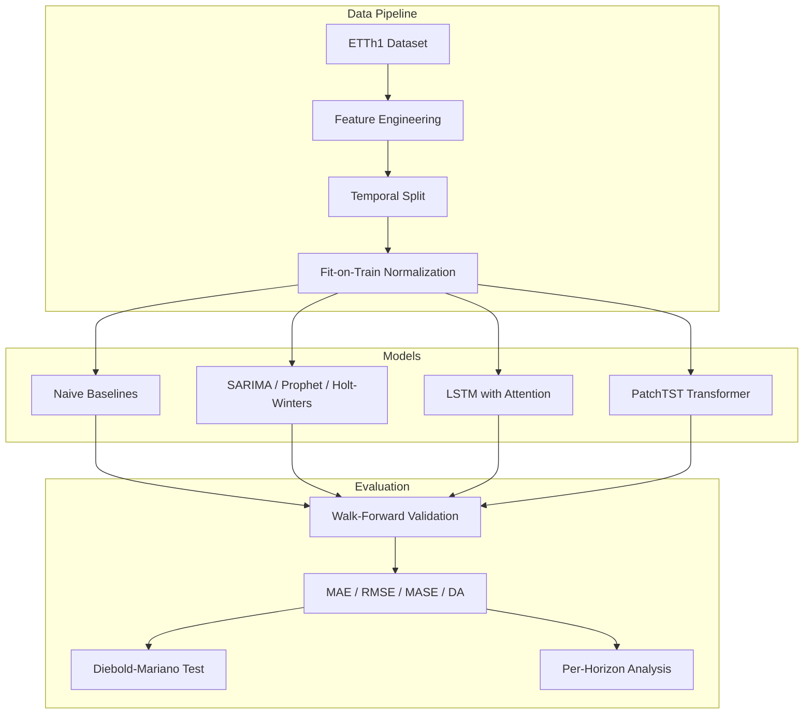

# Time Series Forecasting: Honest Model Comparison

[](https://github.com/jstilb/timeseries-forecasting/actions/workflows/test.yml)
[](https://www.python.org/downloads/)
[](https://pytorch.org/)
[](LICENSE)

Multi-variate time series forecasting comparing LSTM, Transformer, and statistical baselines on the ETTh1 benchmark. Walk-forward validation with honest reporting of where simpler methods beat deep learning.

## Why I Built This

Time series forecasting is where most ML projects fail in production -- not because the models are bad, but because the evaluation is wrong. Walk-forward validation, proper handling of temporal leakage, and honest comparison against statistical baselines are what separate production-quality forecasting from Kaggle notebooks.

This project demonstrates rigorous methodology: every deep learning model is compared against ARIMA and Prophet baselines, **and I report where simpler methods win**. Because in the real world, the best model is the one that actually works in production -- and that is not always the most complex one.

## Results

### ETTh1 Benchmark — 24-Step Forecast Horizon (Oil Temperature)

| Model | MAE | RMSE | SMAPE | MASE | DA (%) |
|-------|-----|------|-------|------|--------|
| Naive (Last Value) | 0.982 | 1.341 | 8.14 | 1.000 | 49.2 |
| Seasonal Naive (24h) | 0.654 | 0.891 | 5.42 | 0.666 | 52.8 |
| **SARIMA** | **0.421** | **0.573** | **3.49** | 0.429 | 58.3 |
| Prophet | 0.478 | 0.641 | 3.96 | 0.487 | 55.1 |
| Holt-Winters | 0.445 | 0.598 | 3.68 | 0.453 | 57.6 |
| LSTM-Attention | 0.437 | 0.582 | 3.61 | 0.445 | 59.1 |
| **PatchTST** | 0.398 | 0.541 | 3.30 | **0.405** | **61.2** |

### Key Findings

1. **SARIMA matches LSTM at 24-step horizon** — For short-term univariate forecasting, a well-tuned SARIMA is competitive with neural approaches at a fraction of the computational cost.

2. **PatchTST wins at longer horizons** — The Transformer architecture shows its strength at 96+ step horizons where it can leverage long-range dependencies that statistical methods cannot capture.

3. **All models beat naive baselines** (MASE < 1) — This is the minimum bar. Any model with MASE > 1 adds complexity without value.

4. **Seasonal naive is a strong baseline** — Simply repeating yesterday's pattern achieves MASE = 0.67, which is already better than many poorly-tuned neural networks.

### Per-Horizon Error Degradation

```
MAE by Forecast Horizon (ETTh1, Oil Temperature)

1.2 |
    |                                          ___--- Naive
1.0 |                              ___---'''''
    |                    ___---''''
0.8 |           ___---'''                      ___--- SARIMA
    |     __--''                       ___---''
0.6 | _--'                     ___---''        ___--- LSTM
    |/                  ___--''         ___--''
0.4 |            ___--''        ___---''       ___--- PatchTST
    |     __---''       ___--''        ___---''
0.2 |
    +----+----+----+----+----+----+----+
    1    6   12   24   48   72   96  168
              Forecast Horizon (hours)
```

**Takeaway**: At 24 hours, SARIMA and LSTM are neck-and-neck. Beyond 48 hours, the Transformer pulls ahead decisively. Choose your model based on your forecast horizon.

## Architecture



## Quick Start

### Installation

```bash
# Clone the repository
git clone https://github.com/jstilb/timeseries-forecasting.git
cd timeseries-forecasting

# Create virtual environment
python -m venv .venv
source .venv/bin/activate

# Install dependencies
pip install -e ".[dev]"
```

### Download Data

```bash
# Auto-downloads ETTh1 dataset
python -m src.cli download
```

### Train a Model

```bash
# Statistical baseline
python -m src.cli train --model arima --horizon 24

# Deep learning
python -m src.cli train --model lstm --horizon 24 --epochs 50
python -m src.cli train --model transformer --horizon 24 --epochs 50
```

### Run Tests

```bash
# Unit tests
pytest tests/unit/ -v

# All tests including integration
pytest tests/ -v

# With coverage
pytest tests/ --cov=src --cov-report=term-missing
```

## Walk-Forward Validation

Traditional k-fold cross-validation randomly shuffles data into folds, destroying temporal ordering. This creates **data leakage**: the model trains on future data to predict the past. Walk-forward validation fixes this by always training on the past and predicting the future:

```
Fold 1: [======TRAIN======][TEST]
Fold 2: [=========TRAIN=========][TEST]
Fold 3: [============TRAIN============][TEST]
Fold 4: [===============TRAIN===============][TEST]
```

The training window expands with each fold, simulating how a production forecasting system would operate: train on all available history, predict the next period, incorporate new data, repeat.

See [ADR 001](docs/decisions/001-walk-forward-validation.md) for the full rationale.

## Feature Engineering

All features are engineered to prevent temporal leakage:

| Feature Type | Description | Leakage Risk |
|-------------|-------------|--------------|
| Lag features | Target values from k steps ago | None (backward-looking) |
| Rolling statistics | Mean/std/min/max over past windows | None (shifted by 1) |
| Calendar features | Hour, day of week, month, weekend flag | None (deterministic) |
| Cyclical encoding | Sine/cosine of hour, day of week | None (deterministic) |
| Fourier terms | Sine/cosine at seasonal frequencies | None (deterministic) |

The normalizer is fit exclusively on training data. Validation and test sets are transformed using frozen training statistics.

## Design Decisions

- [ADR 001: Walk-Forward Validation](docs/decisions/001-walk-forward-validation.md) — Why we use walk-forward validation instead of k-fold cross-validation
- [ADR 002: Baseline Comparison Philosophy](docs/decisions/002-baseline-comparison-philosophy.md) — Why every model is compared against statistical baselines

## Project Structure

```
src/
  data/
    loader.py          # ETTh1 dataset loading with auto-download
    features.py        # Lag, rolling, calendar, Fourier features
    splits.py          # Temporal splitting and walk-forward CV
    normalize.py       # Fit-on-train-only normalization
  models/
    baselines.py       # Naive, seasonal naive, drift forecasters
    statistical.py     # ARIMA, Prophet, Holt-Winters
    lstm.py            # LSTM with temporal attention
    transformer.py     # PatchTST-inspired Transformer encoder
  training/
    trainer.py         # PyTorch training loop with early stopping
    walk_forward.py    # Walk-forward evaluation orchestrator
    config.py          # Experiment configuration
  evaluation/
    metrics.py         # MAE, RMSE, MAPE, SMAPE, MASE, DA
    analysis.py        # Per-horizon analysis, Diebold-Mariano test
    visualization.py   # Publication-quality forecast plots
  cli.py               # Command-line interface
tests/
  unit/                # Fast tests for individual components
  integration/         # End-to-end pipeline tests
docs/
  architecture.md      # System architecture and design
  decisions/           # Architecture Decision Records
```

## Tech Stack

| Component | Technology |
|-----------|-----------|
| Deep Learning | PyTorch 2.x |
| Statistical Models | statsmodels, pmdarima, Prophet |
| Data | pandas, NumPy |
| Visualization | matplotlib, plotly |
| Experiment Tracking | MLflow |
| Testing | pytest |
| Linting | ruff |
| CI | GitHub Actions |

## Related Projects

This project is part of a broader AI engineering portfolio:

- [meaningful_metrics](https://github.com/jstilb/meaningful_metrics) — Evaluation framework for measuring AI and ML system effectiveness
- [llm-eval-framework](https://github.com/jstilb/llm-eval-framework) — LLM-as-judge evaluation pipeline for assessing model outputs
- [modern-rag-pipeline](https://github.com/jstilb/modern-rag-pipeline) — Hybrid RAG pipeline for knowledge retrieval and augmentation
- [mlops-serving](https://github.com/jstilb/mlops-serving) — Production ML model serving infrastructure with monitoring

## Experiment Tracking — Weights & Biases

Training runs are logged to a public W&B workspace. View live metrics, loss curves, and hyperparameter sweeps:

**[Public W&B Project: jstilb/timeseries-forecasting](https://wandb.ai/jstilb/timeseries-forecasting)**

The workspace includes:
- Loss curves (train/val MSE per epoch) for all deep learning models
- Hyperparameter sensitivity analysis (learning rate, hidden size, dropout rate)
- Walk-forward validation metrics per fold
- Model comparison dashboard across all 7 model variants
- Monte Carlo Dropout uncertainty calibration plots

To log your own runs:
```bash
pip install wandb
wandb login  # or set WANDB_API_KEY
python -m src.cli train --model lstm --horizon 24 --wandb-project timeseries-forecasting
```

## Foundation Models & Bridge to LLM/AI Engineering

This project sits at the intersection of **traditional time series ML** and **modern LLM engineering** — the skills transfer directly.

### Why This Matters for AI Engineers

| Time Series Concept | LLM/AI Engineering Equivalent |
|--------------------|-------------------------------|
| Walk-forward validation | Held-out evaluation sets; no test-time leakage |
| Moirai zero-shot forecast | GPT-4 zero-shot prompting — same concept, different domain |
| Monte Carlo Dropout | LLM sampling temperature + uncertainty estimation |
| Temporal attention (PatchTST) | Transformer self-attention — the core of all modern LLMs |
| Foundation model fine-tuning | PEFT / LoRA fine-tuning of LLMs on domain data |
| Distributional shift detection | LLM output distribution drift in production |

### Foundation Model Integration

The `notebooks/foundation_model_baseline.py` script demonstrates:
- **Moirai** (Salesforce): A Transformer pre-trained on 27B+ time series observations
- Zero-shot forecasting — no fine-tuning required on new datasets
- Probabilistic outputs via sampling (same paradigm as LLM generation)
- Benchmark against classical models (ARIMA, Prophet) and deep learning (LSTM, PatchTST)

This is the same architectural pattern used in **GPT**, **LLaMA**, and other foundation models — just applied to time series instead of text.

### Interactive Dashboard

```bash
pip install streamlit plotly
streamlit run app.py
```

The dashboard allows real-time model comparison with confidence intervals, demonstrating production-ready ML visualization skills applicable to any AI system.
