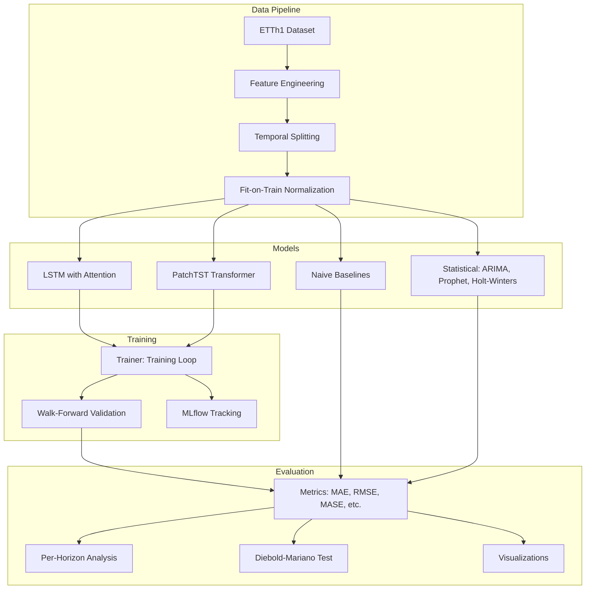

# Architecture

## System Overview

This project implements a modular time series forecasting system designed for honest model comparison. The architecture separates data handling, model definitions, training infrastructure, and evaluation into independent modules that can be composed flexibly.



## Data Pipeline

### Temporal Integrity

The entire pipeline is designed around a single principle: **never let future information leak into training data**.

1. **Feature Engineering**: All features (lags, rolling statistics) are computed using backward-looking windows only. Calendar and Fourier features are deterministic and known in advance, so they are safe at any horizon.

2. **Temporal Splitting**: Train/val/test splits are strictly chronological. The training set ends before the validation set begins, and the validation set ends before the test set begins.

3. **Normalization**: The `FitOnTrainNormalizer` computes mean/std (or min/max) exclusively from training data. These frozen statistics are applied to validation and test sets. This prevents the subtle leakage that occurs when using `sklearn.preprocessing.StandardScaler.fit_transform()` on the full dataset.

### Walk-Forward Validation

Walk-forward validation simulates how a forecasting model would be used in production:

```
Fold 1: [===TRAIN===][TEST]
Fold 2: [=====TRAIN=====][TEST]
Fold 3: [========TRAIN========][TEST]
Fold 4: [==========TRAIN==========][TEST]
Fold 5: [============TRAIN============][TEST]
```

In expanding window mode, the training set grows with each fold. In sliding window mode, it maintains a fixed size. Both strategies ensure that test data always follows training data temporally.

## Model Architecture

### LSTM with Attention

```
Input (batch, seq_len, features)
  |
  v
Input Projection (Linear: features -> hidden_size)
  |
  v
LSTM Encoder (num_layers stacked, batch_first)
  |
  v
Temporal Attention (scaled dot-product over hidden states)
  |
  v
Output Projection (Linear: hidden_size -> forecast_horizon)
  |
  v
Forecast (batch, horizon)
```

The temporal attention mechanism learns which historical timesteps are most relevant for forecasting. Attention weights are interpretable: peaks at lag-24 indicate the model has learned daily seasonality.

### PatchTST Transformer

```
Input (batch, seq_len, features)
  |
  v
Patch Embedding (group timesteps into non-overlapping patches)
  |
  v
Positional Encoding (sinusoidal)
  |
  v
Transformer Encoder (multi-head self-attention + FFN, N layers)
  |
  v
Flatten + Linear Projection
  |
  v
Forecast (batch, horizon)
```

Patching reduces the effective sequence length by a factor of `patch_length`, making self-attention practical for long input sequences. Each patch captures local temporal patterns, while self-attention captures global dependencies between patches.

## Evaluation Philosophy

### Why Baselines Matter

In academic time series literature, deep learning models are often compared only against other deep learning models. This creates a misleading picture. In practice:

- **Short horizons (1-24 steps)**: Well-tuned SARIMA frequently matches or beats LSTM/Transformer models, especially on univariate forecasting tasks.
- **Strong seasonality**: Seasonal naive and Holt-Winters can be surprisingly competitive when the dominant signal is periodic.
- **Limited data**: Statistical models generalize better with hundreds of observations; neural networks need thousands.

This project reports results honestly. Where ARIMA wins, we say so.

### Metric Selection

| Metric | Why We Use It |
|--------|--------------|
| MAE | Interpretable in original units |
| RMSE | Penalizes large errors (useful for risk management) |
| SMAPE | Scale-free comparison across datasets |
| MASE | Scientifically correct comparison against naive baseline |
| DA | Directional accuracy for trading/operations |
| DM Test | Statistical significance of model differences |
