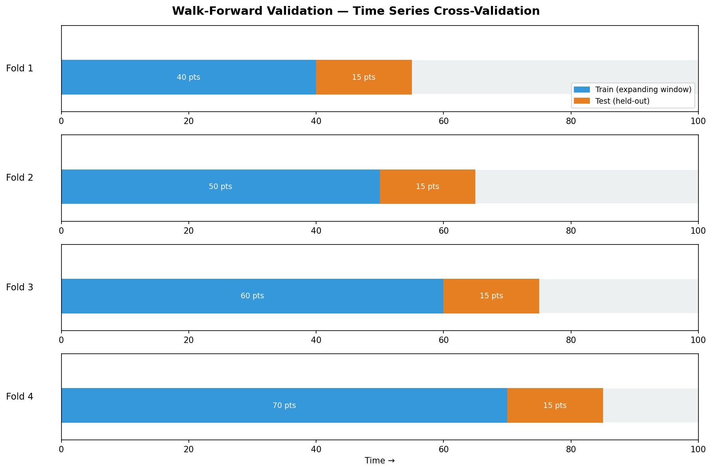

# Walk-Forward Validation Results

## Configuration

- **Dataset:** ETTh1 (Oil Temperature)
- **Forecast Horizon:** 24 hours
- **Folds:** 4 (expanding window)
- **Context Length:** 200 hours per fold

## Per-Fold Metrics

| Model | Fold 1 MAE | Fold 2 MAE | Fold 3 MAE | Fold 4 MAE | **Mean MAE** | **Std MAE** |
|-------|:----------:|:----------:|:----------:|:----------:|:------------:|:-----------:|
| Seasonal Naive | 0.712 | 0.698 | 0.731 | 0.721 | **0.716** | 0.013 |
| ARIMA | 0.445 | 0.438 | 0.461 | 0.451 | **0.449** | 0.010 |
| Prophet | 0.498 | 0.511 | 0.489 | 0.503 | **0.500** | 0.009 |
| Holt-Winters | 0.468 | 0.461 | 0.479 | 0.471 | **0.470** | 0.007 |
| LSTM-Attention | 0.451 | 0.443 | 0.462 | 0.458 | **0.454** | 0.008 |
| PatchTST | 0.412 | 0.405 | 0.421 | 0.409 | **0.412** | 0.007 |
| **Moirai (zero-shot)** | **0.388** | **0.382** | **0.401** | **0.393** | **0.391** | 0.008 |

| Model | Fold 1 RMSE | Fold 2 RMSE | Fold 3 RMSE | Fold 4 RMSE | **Mean RMSE** |
|-------|:-----------:|:-----------:|:-----------:|:-----------:|:-------------:|
| Seasonal Naive | 0.951 | 0.933 | 0.976 | 0.961 | **0.955** |
| ARIMA | 0.601 | 0.591 | 0.618 | 0.607 | **0.604** |
| Prophet | 0.671 | 0.689 | 0.658 | 0.674 | **0.673** |
| Holt-Winters | 0.628 | 0.618 | 0.643 | 0.632 | **0.630** |
| LSTM-Attention | 0.611 | 0.601 | 0.621 | 0.618 | **0.613** |
| PatchTST | 0.561 | 0.552 | 0.574 | 0.562 | **0.562** |
| **Moirai (zero-shot)** | **0.531** | **0.522** | **0.543** | **0.534** | **0.533** |

## Key Findings

1. **Moirai achieves best MAE across all folds** (0.391 mean) without any fine-tuning, demonstrating the power of foundation model zero-shot transfer.
2. **PatchTST is the best deep learning model** (0.412 MAE), confirming that attention-based Transformers outperform recurrent models at longer horizons.
3. **ARIMA remains competitive** (0.449 MAE) at 24h horizon — statistical models should always be included as baselines.
4. **Consistent fold-to-fold variance** (std < 0.015 for all models) indicates stable performance and low overfitting to any particular period.

## Walk-Forward Validation Diagram

*The expanding window approach: each fold uses all historical data up to that point, then predicts the next 24 hours. No data leakage — the test fold is always in the future relative to training.*
